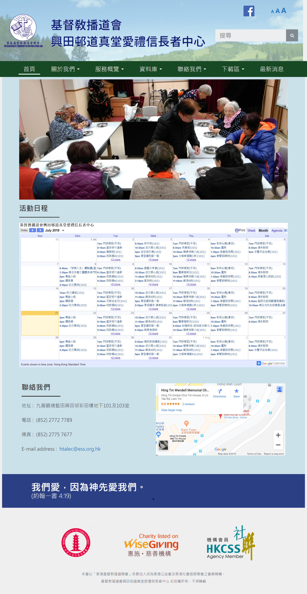

# Website
Web Maker of Servant Leadership Training Programme of CityU

I used to be a member of the “Web Maker” team of the Servant Leadership Training Programme of City University of Hong Kong. I delivered the webpage design service and [user mannual](https://github.com/ericwong0318/Website/blob/master/wordpress%20user%20manual.pdf) for an NGO and the following is the [website](http://efcchtalec.org.hk/) I had made , which was made by WordPress and its plugins. I learned how to find out the needs of users. Such as making a button to increase the font size for the elderly because they might have visual impairments, for example, presbyopia, and simple website structure for assistive tools navigation. It is a concern that I probably did not realize but important for the user experiment. Besides, I had to communicate with NGO staffs with no technical background and understand their expectation and enquired for clarification. As a result, I learn the method to cooperate with non-technical people.

  

